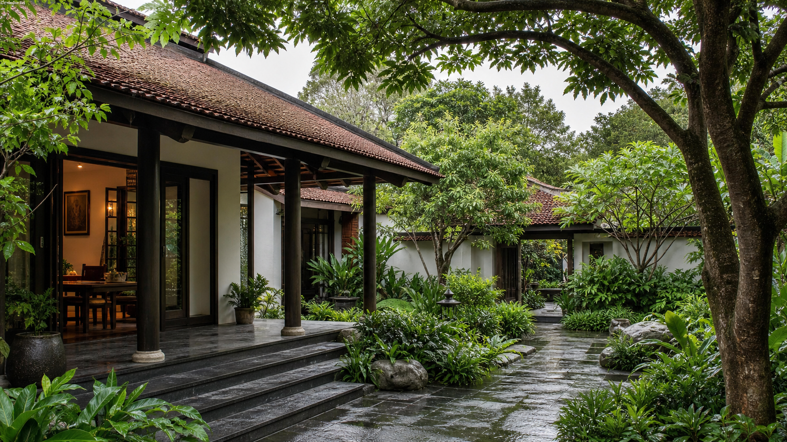
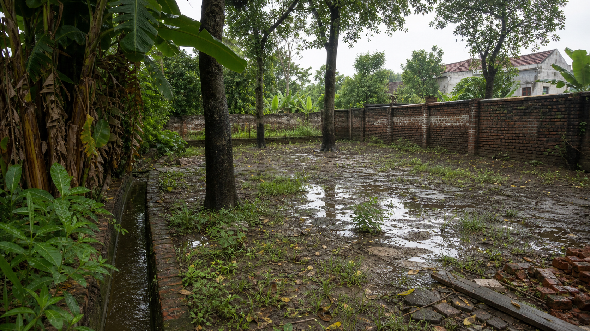
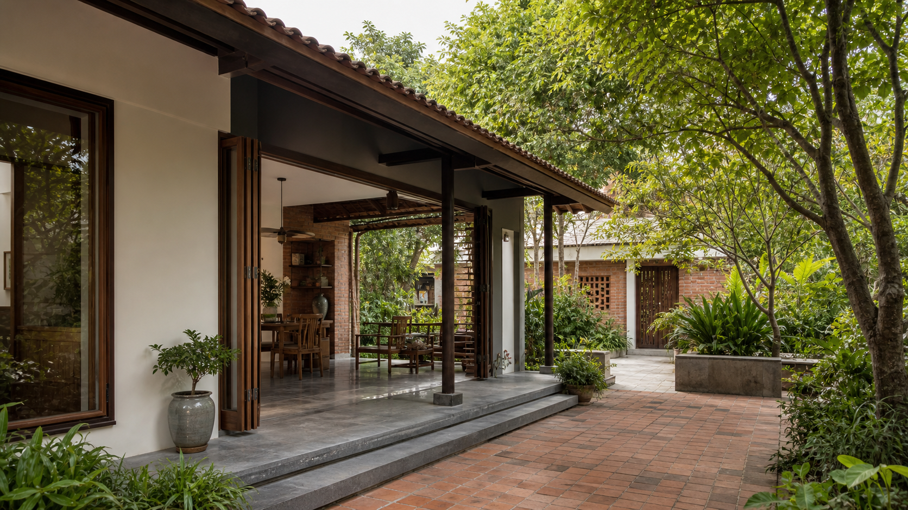
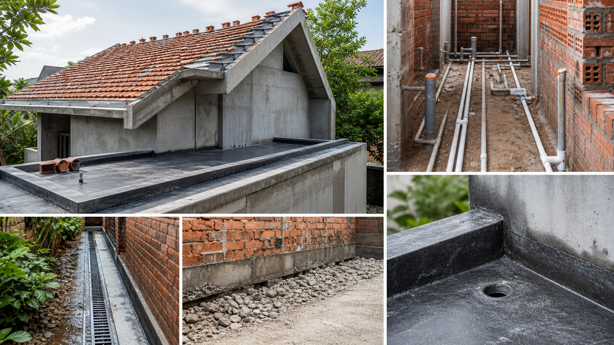
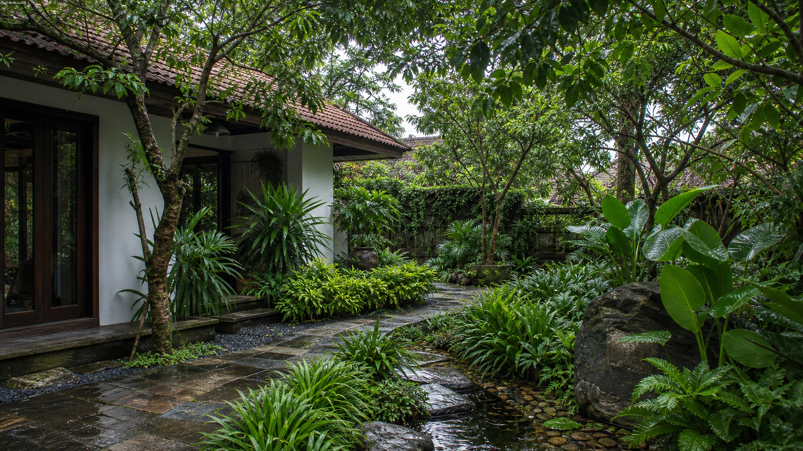
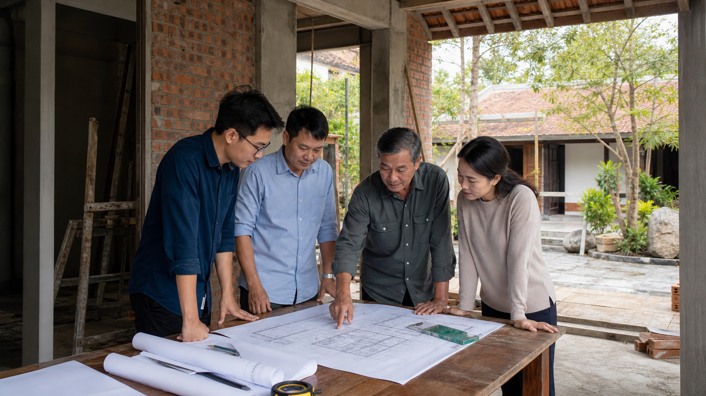
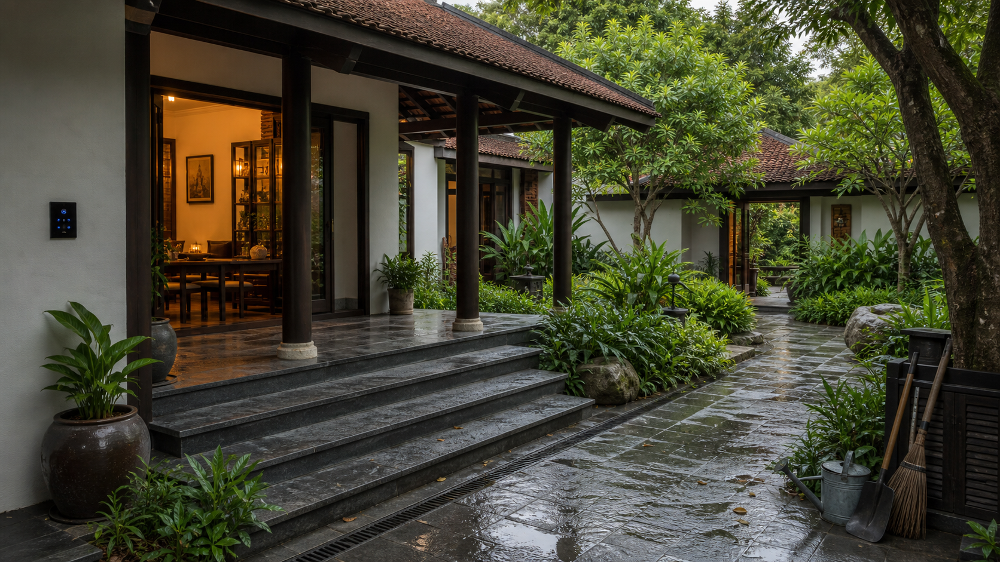
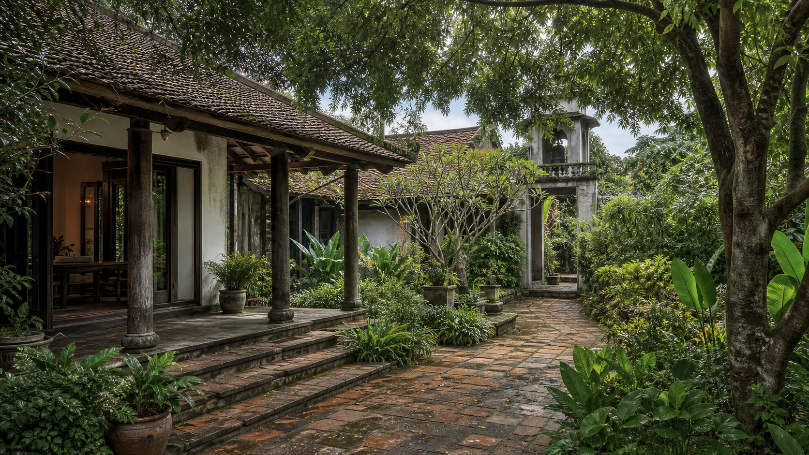

# Hình ảnh trực quan theo 8 phần học

Bộ ảnh này thay thế các hình tự vẽ và ảnh ngẫu nhiên trước đó. Mỗi ảnh được tạo theo hướng photorealistic để người học nhìn thấy bối cảnh nhà - vườn - khí hậu - thi công - vận hành một cách chân thực hơn. Ảnh không nhúng logo Lumi, không chứa chữ giả và không dùng làm sơ đồ chính xác; phần giải thích, mô hình và checklist vẫn nằm trong HTML/Markdown.

## Tư duy tổng dự án

*Caption: Ảnh photorealistic về nhà vườn Bắc Bộ như một hệ sống dài hạn: nhà, hiên, sân, cây và quyết định của chủ nhà.*

## Bối cảnh Bắc Bộ

*Caption: Ảnh photorealistic giúp người học nhìn khu đất qua nước, cây, tường rào, bề mặt ẩm và dấu hiệu khí hậu.*

## Ý tưởng kiến trúc

*Caption: Ảnh photorealistic về quan hệ hiên, sân, mái, vật liệu và vườn trong một ngôi nhà nhiệt đới Bắc Bộ.*

## Thiết kế kỹ thuật nhà ở

*Caption: Ảnh photorealistic về lớp kỹ thuật, thi công, mái, tường, đường nước và điểm kiểm tra trong khí hậu nóng ẩm.*

## Thiết kế vườn nhiệt đới Bắc Bộ

*Caption: Ảnh photorealistic về vườn nhiều tầng cây, lối đi, đất, nước và chiến lược chăm sóc dài hạn.*

## Quản lý thiết kế, ngân sách và thi công

*Caption: Ảnh photorealistic về phối hợp chủ nhà, kiến trúc sư, kỹ sư và nhà thầu trên công trường nhà vườn.*

## Hoàn thiện, bàn giao và vận hành

*Caption: Ảnh photorealistic về nhà vườn sau hoàn thiện, có ánh sáng, thiết bị, lối đi và dấu hiệu vận hành gọn gàng.*

## Tư duy vòng đời 30-50 năm

*Caption: Ảnh photorealistic về ngôi nhà vườn trưởng thành, vật liệu có patina, cây lớn và dấu vết chăm sóc qua nhiều năm.*
